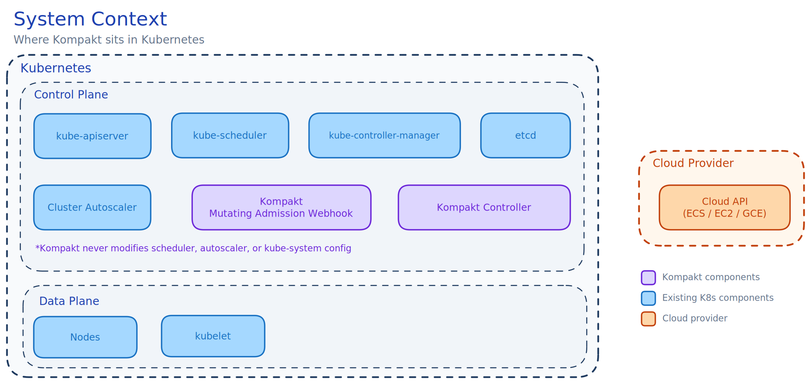

# How It Works

## The core idea

Kompakt occupies the gap between admission and scheduling. It holds pods at admission time using Kubernetes [scheduling gates](https://kubernetes.io/docs/concepts/scheduling-eviction/pod-scheduling-readiness/) (GA since v1.30) and releases them when rules confirm that capacity is available, incoming, or needs to be requested. Everything below Kompakt (the scheduler, the autoscaler) is unmodified.

## Components

### Mutating admission webhook

Intercepts Pod CREATE requests. For each incoming pod:

1. Check if the pod has a `packer.kompakt.io/packing-profile` label
2. If no label: allow the pod through untouched
3. If label present: look up the named PackingProfile
4. If profile not found: **reject the pod** with error "PackingProfile not found"
5. If profile found: inject `spec.schedulingGates` and a `kompakt.io/trace-id` annotation

| Rule | Gate |
|---|---|
| WaitForWorkloadPacking | `kompakt.io/wait-for-workload-packing` |
| WaitForNodeReady | `kompakt.io/wait-for-node-ready` |

### Coordination controller

Watches gated pods and nodes. For each gated pod, it:

1. Syncs the [node ledger](node-ledger.md) with current cluster state
2. Runs the profile's [rule plugins](rule-plugins.md) in order
3. Releases gates, holds gates, or releases with node affinity

### PackingProfile CRD

A cluster-scoped resource defining demand extraction, capacity source, node group templates, rule plugins, and reservation timeout. Pods reference a profile by name via the `packer.kompakt.io/packing-profile` label. See [PackingProfiles](packing-profiles.md).

## Request flow

### Scenario 1: Existing node has capacity (BinPack)

1. Pod A is created with label `packer.kompakt.io/packing-profile: my-profile`
2. Webhook injects `kompakt.io/wait-for-workload-packing` gate
3. Controller syncs ledger: node-1 has 4 CPU free
4. BinPack rule finds node-1 fits Pod A's 1 CPU demand, reserves the slot
5. Controller releases gate, injects `nodeAffinity` pointing to node-1
6. Scheduler places Pod A on node-1

### Scenario 2: No capacity, need scale-up (WaitForNodeReady)

1. Pod A is created, no nodes have capacity. WaitForNodeReady **releases immediately** (passthrough)
2. Autoscaler sees Pod A, triggers scale-up. Kompakt detects this from the `cluster-autoscaler-status` ConfigMap
3. Pod B is created while the node is provisioning
4. WaitForNodeReady: in-flight node can fit Pod B. **Hold the gate**, reserve capacity on the incoming node
5. Pod B stays invisible to the autoscaler. No second scale-up triggered.
6. Node becomes Ready. Controller re-evaluates Pod B: **release with node affinity**
7. Scheduler places Pod B on the same node. Result: 1 node instead of 2.

### Scenario 3: Timeout safety net

If a pod stays gated longer than `reservationTimeout` (default 3m), the gate is released unconditionally.

## What the scheduler and autoscaler see

The scheduler sees pods appear later than usual (gated, then released). It does not know Kompakt exists. The autoscaler sees fewer simultaneously-unschedulable pods. Instead of 6 at once triggering 6 nodes, it sees 1-2 at a time and provisions accordingly.

## Observability

See [Observability](../guides/observability.md) and [Metrics Reference](../reference/metrics.md).
## Zero scheduler integration

Kompakt does not modify or replace kube-scheduler or cluster-autoscaler, require privileged DaemonSets or cluster-admin RBAC, or set `schedulerName` on user pods. Install is a Helm chart. Uninstall is deleting the webhook configuration.
## Workload universality

| Workload type | How it works |
|---|---|
| Deployment (via ReplicaSet) | Each pod gated individually, coordinated with siblings |
| StatefulSet | Each pod gated, ordered creation respected |
| DaemonSet | Excluded by default (per-node workloads) |
| Job, CronJob | Gated, composes with Kueue if present |
| KServe InferenceService | Underlying Deployment pods gated transparently |
| Argo Workflow | Each step pod gated individually |
| Ray RayCluster | Each worker pod gated |
| Kubeflow PyTorchJob / TFJob | Each replica gated |
| Plain Pod | Gated if label is present |
