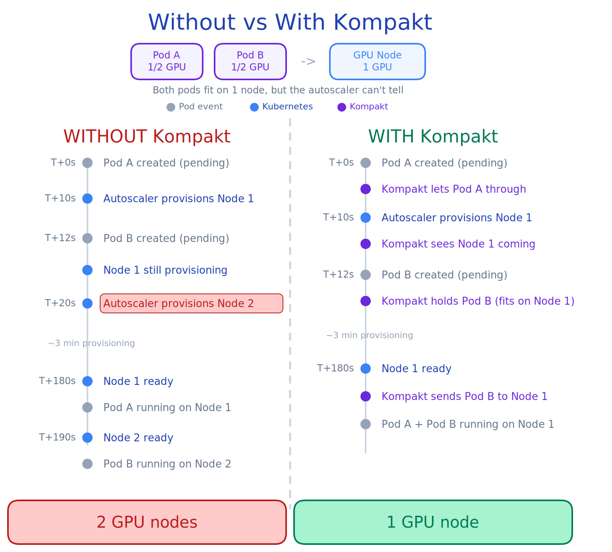

# Kompakt

**Keep your cluster compact.**

Kompakt is a Kubernetes admission-time coordinator that prevents cluster autoscalers from over-provisioning nodes. It uses [scheduling gates](https://kubernetes.io/docs/concepts/scheduling-eviction/pod-scheduling-readiness/) (GA in K8s v1.30) to control when pods become visible to the scheduler and autoscaler, coordinating scale-up events across all workload types: Deployments, StatefulSets, Jobs, KServe, Argo, Ray, and anything else that creates pods.

- No custom scheduler
- No privileged DaemonSets
- No vendor lock-in

## The problem

The cluster autoscaler evaluates pending pods in scan cycles (every 10-30 seconds). Pods that arrive in different cycles are not batched together. When a node is being provisioned but not yet Ready, the autoscaler simulates whether pending pods will fit on it -- but this simulation only works for resources declared in the node template.

This causes over-provisioning whenever demand arrives faster than the autoscaler can batch it. Some examples:

**Fractional GPU sharing**: You have 2 notebooks, each needing half a GPU. One node is enough. But the autoscaler's node template does not declare `gpu-mem` (only `gpu-core.percentage`), so it cannot simulate that the second notebook fits on the incoming node. It provisions a second GPU node. You pay double.

**Burst deployments**: You deploy 3 services simultaneously, each with topology spread constraints. The autoscaler sees them in separate scan cycles and provisions nodes independently, often 1 node per service instead of packing them together.

**Scale-from-zero**: A node pool scales to zero when idle. Two requests arrive within seconds. The first triggers a node, the second cannot see it yet and triggers another.

These are not bugs in the autoscaler. It makes the best decision it can with the information available at each scan cycle. The problem is that no one coordinates demand across cycles. Kompakt fills that gap.

## What Kompakt does

Kompakt coordinates pods in two ways, depending on which rules you configure:

**Pack onto existing capacity** (`WaitForWorkloadPacking`): When your cluster has running nodes with spare capacity, Kompakt finds the best-fit node and releases the pod with node affinity. Minimizes wasted resources across existing nodes.

**Coordinate scale-ups** (`WaitForNodeReady`): When the cluster needs new nodes, Kompakt lets the first pod through to trigger the autoscaler, then holds subsequent pods until the new node is ready. Prevents the autoscaler from provisioning redundant nodes.

You can use one or both rules per profile. For most production clusters, both rules together provide the best results.

## How it works

1. **Webhook** intercepts pod creation, matches against a `PackingProfile` CRD, injects scheduling gates
2. **Controller** maintains a node ledger tracking existing capacity and pending autoscaler nodes
3. **Rules** evaluate each gated pod: release immediately, hold for incoming node, or release with node affinity
4. **Your existing scheduler and autoscaler** continue working untouched

## What Kompakt does not do

- Replace kube-scheduler or the cluster autoscaler
- Allocate GPU devices
- Manage quota or admission control
- Federate across clusters

## Next steps

- [Why Kompakt? Read the problem statement](introduction/problem-statement.md)
- [Compare with existing tools](introduction/prior-art.md)
- [Install Kompakt](getting-started/installation.md)
- [Create your first PackingProfile](getting-started/first-profile.md)
- [Understand how it works](concepts/how-it-works.md)
